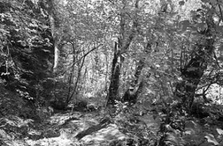
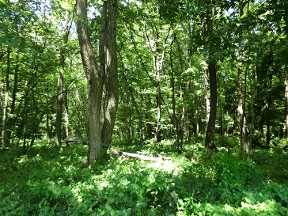
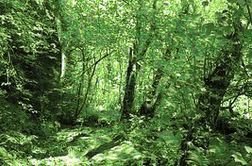
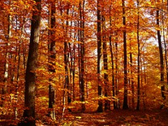
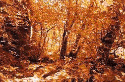
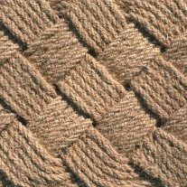
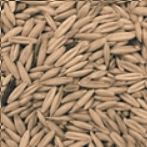

# Transfer color to grayscale image

[](https://travis-ci.org/mshr-h/Color_Transferring)
[](https://github.com/mshr-h/Color_Transferring/blob/master/LICENSE)

## Description

This is an implementation of color transferring using C/C++ on Qt platform.
The algorithm is entirely [written in C](lib_c/transfer_color.c).

## What's the Colorization

Colorization is a technique to convert a grayscale image into a colored image.

- [Film colorization - Wikipedia, the free encyclopedia](https://en.wikipedia.org/wiki/Film_colorization)
- [Hand-colouring of photographs - Wikipedia, the free encyclopedia](https://en.wikipedia.org/wiki/Hand-colouring_of_photographs)

## Example

| target | reference | output |
| :----: | :-------: | :----: |
|  |  |  |
|  |  |  |
|  |  |  |

- Window size: 5x5 pixels
- Sampling method: regular sampling

## Requirement

- Qt 5.3 or newer (probably works on older than 5.3 but not tested)

## Directory tree

```text
include/      header files
inImg_db/     sample input images
lib_c/        C code
lib_qc/       C structure <-> C++ data conversion
outImg_db/    sample output images
```

## Reference

- [T Welsh, M Ashikhmin, K Mueller, Transferring color to greyscale images, ACM Transactions on Graphics (TOG), 2002](https://classes.soe.ucsc.edu/cmps290b/Fall05/readings/colorize-sig02.pdf)
